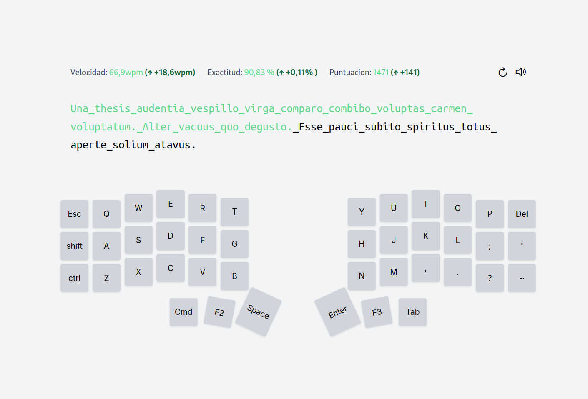

🧮 typing speed 
===

Here is my “Typing Speed” application, built with Angular 18. I made it because I like to make my own tools and I wanted to keep track of my typing speed. My current keyboard is on the screen: the Corne V3 designed by Foostan. Here's what I came up 

  

